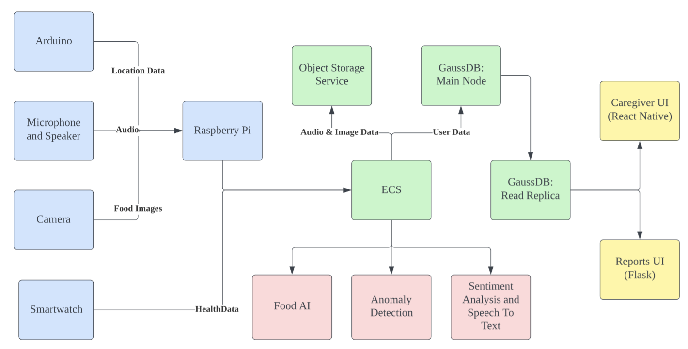
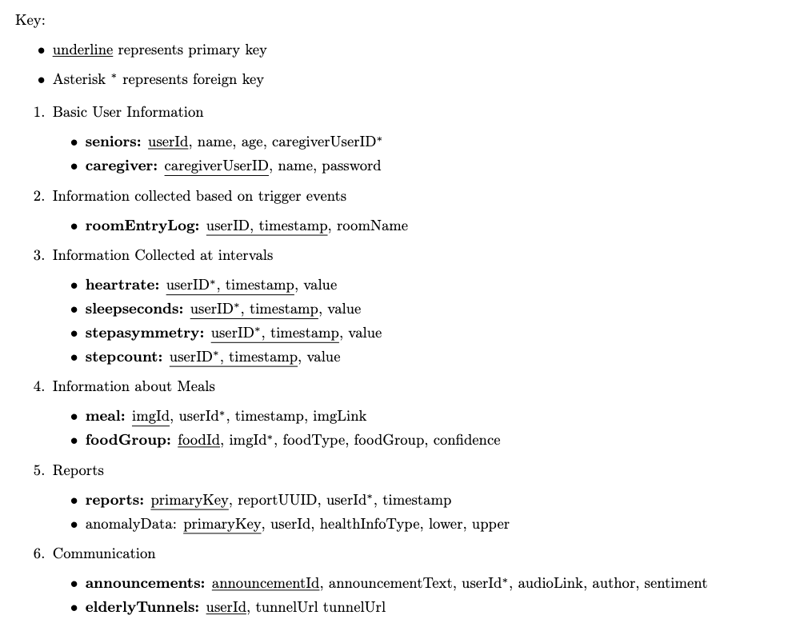

# Contents

[Caregiver App](#elderberry-caregiver-application)

- [📌 Try our app](#try-our-app-🧑‍🔬)
  - [Try on expo (Recommended)](#try-it-on-expo) <br>
  - [Local install](#local-installation-expo) <br>
- [Project Info](#project-info)
  - [Tools](#languages--tools)
  - [Directory structure](#project-structure)

[Backend Server](#huawei-databases)

- [Intro](#Intro) <br>
- Technical Details
  - [Navigation](#Navigating-this-Repository) <br>
  - [Tech Stack](#Technical-Stack) <br>
  - [Db Design](#Database-Design) <br>
- Try it out!
  - [📌 Report demo](#Report-Demo)<br>

<br>

# Elderberry Caregiver Application

- [Try our app](#try-our-app-🧑‍🔬)
  - [Try on expo (Recommended)](#try-it-on-expo) <br>
  - [Local install](#local-installation-expo) <br>
- [Project Info](#project-info)
  - [Tools](#languages--tools)

---

## Try our app 🧑‍🔬

### Try it on expo (Recommended) 👍

1. Download the expo app

   [On Google Play Store](https://play.google.com/store/apps/details?id=host.exp.exponent&hl=en_SG&gl=US)

   [On App Store](https://apps.apple.com/us/app/expo-go/id982107779)

2. Create an expo account
3. Open the camera app on your device and scan the code below

   

   OR

   Open this [link](exp://exp.host/@geetee/Elderberry?release-channel=default) on your device

<br>

### Local Installation 💻

1. Download the expo app

   [On Google Play Store](https://play.google.com/store/apps/details?id=host.exp.exponent&hl=en_SG&gl=US)

   [On App Store](https://apps.apple.com/us/app/expo-go/id982107779)

2. Clone repo

   ```
   $ git clone 'https://github.com/huawei-hackathon/caregiver-app.git'

   $ cd caregiver-app
   ```

3. Yarn install
   ```
   $ yarn
   ```
4. Start expo server
   ```
   $ expo start
   ```
5. Scan QR code on http://localhost:19002

<br>

## Project Info 🙋

### Languages & tools 🔧

#### App building

- [React Native](https://reactnative.dev/) was used to code the application. React Native allows apps written in Javascript to be run on both iOS and Android.

#### Graph plotting

- [Responsive Linechart](https://www.npmjs.com/package/react-native-responsive-linechart) to plot beautiful line charts within project
- [Victory](https://formidable.com/open-source/victory/) for bar charts

#### Other Functionality

- [Expo AV](https://docs.expo.dev/versions/latest/sdk/av/) for audio recording and playback
- [React Native Webview](https://github.com/react-native-webview/react-native-webview) to render html reports within the application
- [Axios](https://www.npmjs.com/package/axios) for calling our API server running on Huawei ECS

#### Styling

- [Native Base](https://nativebase.io/) enables clean app design quickly

#### App state management

- [Redux](https://redux.js.org/introduction/getting-started) for app state management
- [React Navigation](https://reactnavigation.org/docs/getting-started) for app navigation

  <br>


# Elderberry-Backend

Try it out!
- [Report demo](#Report-Demo)<br>

## Intro
Repository for Flask server running on Huawei Elastic Cloud Server (ECS). Provides backend routes for Elderberry project and runs Food Detection AI, Sentiment Analysis, Anomaly Detection and the generation of monthly reports.

The monthly report system is hosted at http://119.13.104.214:80/customizeReport.

## Navigating this Repository
The file `app.py` contains the list of all routes. It redirects each set of relavent routes (i.e. bluetooth routes) to the corresponding file in `/routes`, for instance `/routes/bluetooth.py`. That file processes the query and uses `/hctools/bluetooth.py` (hctools referring to Huawei Cloud tools) to invoke GaussDB, OBS or otherwise.

The `/mockData` files help generate mock data for the back-end reports and the front-end app.

## Technical Stack


## Database Design


## Report Demo
To demonstrate different kind of reports that can be generated, we created a webpage to try generating the reports for different profiles. This shows the different type of reports that can be made based on the user. <br>
Try it out [here](http://119.13.104.214)

----

# Elderberry-Hardware
This build is in a linux environment (Raspbian) for Raspberry Pi 2B (armv7l)

## Hardware Setup
<figure>

<figcaption align = "center">The Raspberry Pi 2B used is connected to a Webcam, Speaker, Buttons via GPIO, Ethernet and Power.</figcaption>
</figure>

<figure>

<figcaption align = "center">The buttons used are generic keyboard switches for this MVP. Buttons make it more straightforward for the elderly to interact with our product. One button is to Record Message, other is to Replay previous message.</figcaption>
</figure>

<figure>

<figcaption align = "center">Each ESP32 Communicates to the Pi via MQTT over WiFi, allowing us to do indoor location positioning via comparison of Bluetooth RSSI.</figcaption>
</figure>

<figure>

<figcaption align = "center">Using OpenCV, The webcam takes a picture when motion is detected, and uploads the picture to Huawei Cloud for food detection. Webcam used is a Logitech C310.</figcaption>
</figure>

<figure>

<figcaption align = "center">Generic speaker is connected to the Raspberry Pi for announcements and medicine reminders.</figcaption>
</figure>

## Camera Module
Photos are taken by OpenCV when motion is detected, before being uploaded.

## Communication Module
### Announcements
`announce.py` contains code for announcements and scheduled medicine reminders.

Running a local Flask Server, we generate a tunnel using Ngrok which is POST to the Huawei Cloud Server. This allows the Cloud Server to POST new messages and recordings to the pi.

For text announcements, we use gTTS to generate an audio of the announcement. 

Then, both gTTS audio or recorded messages are played with vlc.

#### Scheduled Medicine Reminders
We make use of APScheduler and an Sqlite database to store information on medicine reminders, and schedule announcements to remind the Elderly to take their medicine.

### Recordings
`record.py` contains code for the elderly to record messages back to the caregiver. Recordings are triggered by GPIO

## MQTT-Bluetooth Module
This folder contains the code for the MQTT Bluetooth Client running on the Raspberry Pi.

Using Paho MQTT, `client.py` subscribes to the local MQTT Mosquitto server running on the Pi.

Comparing the reported RSSI Strengths of the Huawei Smartwatch with the ESP32 Bluetooth Beacons, our code derives the closest beacon, and POSTS it to the Huawei Cloud ECS Instance to update the current room the elderly is in.

### ESP32 Bluetooth Beacons
These ESP32s are loaded with [ESPresense](https://github.com/ESPresense/ESPresense) v2.0.34, and communicate to the Pi via MQTT.
